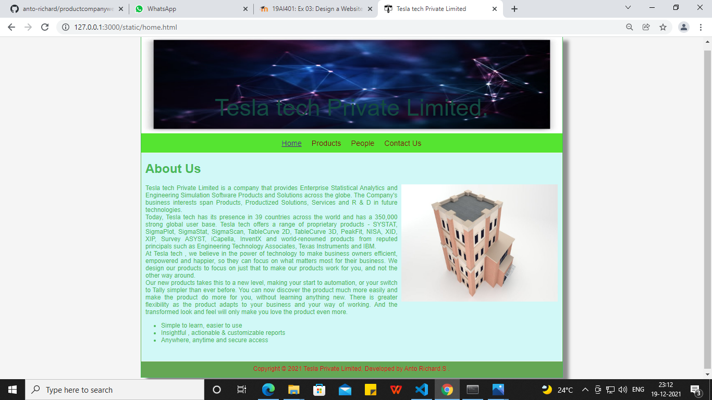
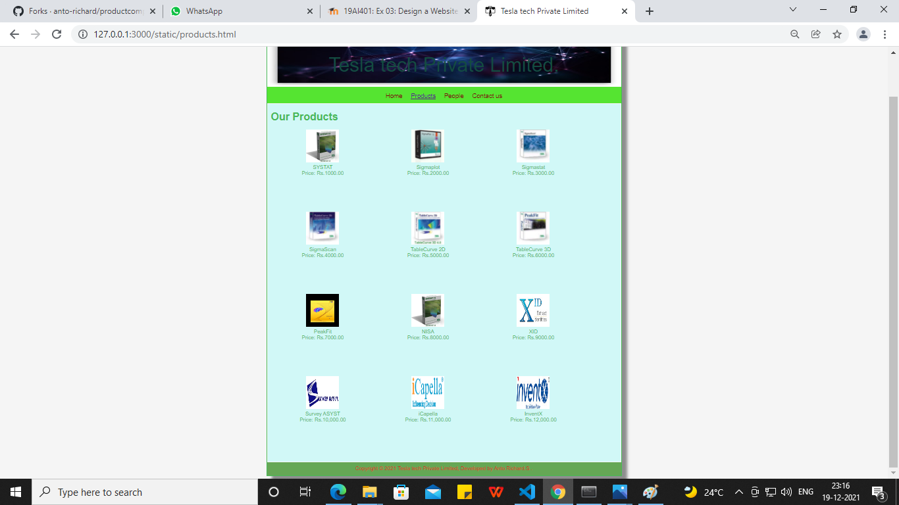
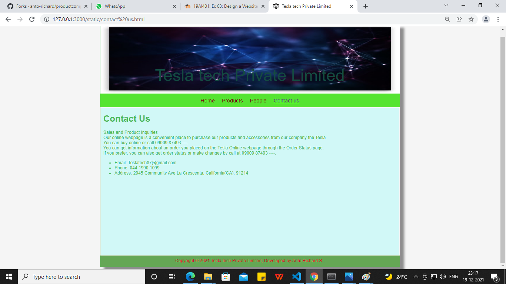

# Web Design for a Software Product Company

## AIM:

To design a static website for a software product company.

## DESIGN STEPS:

### Step 1:

Requirement collection.

### Step 2:

Creating the layout using HTML and CSS.

### Step 3:

Updating the sample content.

### Step 4:

Choose the appropriate style and color scheme.

### Step 5:

Validate the layout in various browsers.

### Step 6:

Validate the HTML code.

### Step 6:

Publish the website in the given URL.

## PROGRAM :

## Home code:
```
<!DOCTYPE html>
<html lang="en">
  <head>
    <title>Tesla tech Private Limited</title>
    <link rel="stylesheet" href="./css/layout.css" />
    <link rel="icon" href="./img/iconsft.png" type="image/x-icon" />
  </head>

  <body>
    <div class="container">
      <div class="banner">Tesla tech Private Limited.</div>
      <div class="menu">
        <div class="menuitemselected"><a href="/static/home.html">Home</a></div>
        <div class="menuitem"><a href="/static/products.html">Products</a></div>
        <div class="menuitem"><a href="/static/People.html">People</a></div>
        <div class="menuitem"><a href="/static/contact us.html">Contact Us</a></div>
      </div>
      <div class="content">
        <div class="homecontent">
          <h1>About Us</h1>
          
          <div class="contenttext">
            Tesla tech Private Limited is a company that provides Enterprise Statistical Analytics and Engineering Simulation Software Products and Solutions across the globe. The Company's business interests span Products, Productized Solutions, Services and R & D in future technologies.<br>
            Today, Tesla tech has its presence in 39 countries across the world and has a 350,000 strong global user base. Tesla tech offers a range of proprietary products - SYSTAT, SigmaPlot, SigmaStat, SigmaScan, TableCurve 2D, TableCurve 3D, PeakFit, NISA, XID, XIP, Survey ASYST, iCapella, InventX and world-renowned products from reputed principals such as Engineering Technology Associates, Texas Instruments and IBM.</br>
            At Tesla tech , we believe in the power of technology to make business
            owners efficient, empowered and happier, so they can focus on what
            matters most for their business. We design our products to focus on
            just that to make our products work for you, and not the other way
            around.
            <br />
            Our new products takes this to a new level, making your
            start to automation, or your switch to Tally simpler than ever
            before. You can now discover the product much more easily and make
            the product do more for you, without learning anything new. There is
            greater flexibility as the product adapts to your business and your
            way of working. And the transformed look and feel will only make you
            love the product even more.
            <ul>
              <li>Simple to learn, easier to use</li>
              <li>Insightful , actionable & customizable reports</li>
              <li>Anywhere, anytime and secure access</li>
            </ul>
          </div>
        </div>
      </div>
      <div class="footer">
        Copyright &#169; 2021 Tesla Private Limited, Developed by Anto Richard.S .
      </div>
    </div>
  </body>
</html>
```
## Product code:
```
<!DOCTYPE html>
<html lang="en">
  <head>
    <title>Tesla tech Private Limited</title>
    <link rel="stylesheet" href="./css/layout.css" />
    <link rel="icon" href="./img/iconsft.png" type="image/x-icon" />
  </head>

  <body>
    <div class="container">
      <div class="banner">Tesla tech Private Limited.</div>
      <div class="menu">
        <div class="menuitem"><a href="/static/home.html">Home</a></div>
        <div class="menuitemselected">
          <a href="/static/products.html">Products</a>
        </div>
        <div class="menuitem"><a href="/static/People.html">People</a></div>
        <div class="menuitem"><a href="/static/contact us.html">Contact us</a></div>
      </div>
      <div class="content">
        <div class="productcontent">    
          <h1>Our Products</h1>
          <div class="productitems">
              <div class="productitem"> 
                  <div class="itemimage">
                  
                  </div>
                  <div class="itemname">SYSTAT</div>
                  <div class="itemprice">Price: Rs.1000.00 </div>
              </div>
              <div class="productitem"> 
                  <div class="itemimage">
                  
                  </div>
                  <div class="itemname">Sigmaplot</div>
                  <div class="itemprice">Price: Rs.2000.00 </div>
              </div>
              <div class="productitem"> 
                <div class="itemimage">
                
                </div>
                <div class="itemname">Sigmastat</div>
                <div class="itemprice">Price: Rs.3000.00 </div>
              </div>
              <div class="productitem"> 
                <div class="itemimage">
                
                </div>
                <div class="itemname">SigmaScan</div>
                <div class="itemprice">Price: Rs.4000.00 </div>
              </div>
              <div class="productitem"> 
                <div class="itemimage">
                
                </div>
                <div class="itemname">TableCurve 2D</div>
                <div class="itemprice">Price: Rs.5000.00 </div>
              </div>
              <div class="productitem"> 
                <div class="itemimage">
                
                </div>
                <div class="itemname">TableCurve 3D</div>
                <div class="itemprice">Price: Rs.6000.00 </div>
              </div>
              <div class="productitem"> 
                <div class="itemimage">
                
                </div>
                <div class="itemname">PeakFit</div>
                <div class="itemprice">Price: Rs.7000.00 </div>
              </div>
              <div class="productitem"> 
                <div class="itemimage">
                
                </div>
                <div class="itemname">NISA</div>
                <div class="itemprice">Price: Rs.8000.00 </div>
              </div>
              <div class="productitem"> 
                <div class="itemimage">
                
                </div>
                <div class="itemname">XID</div>
                <div class="itemprice">Price: Rs.9000.00 </div>
              </div>
              <div class="productitem"> 
                <div class="itemimage">
                
                </div>
                <div class="itemname">Survey ASYST</div>
                <div class="itemprice">Price: Rs.10,000.00 </div>
              </div>
              <div class="productitem"> 
                <div class="itemimage">
                
                </div>
                <div class="itemname">iCapella</div>
                <div class="itemprice">Price: Rs.11,000.00 </div>
              </div>
              <div class="productitem"> 
                <div class="itemimage">
                
                </div>
                <div class="itemname">InventX</div>
                <div class="itemprice">Price: Rs.12,000.00 </div>
              </div>
          </div>
          </div>        
      </div>
      <div class="footer">
        Copyright &#169; 2021 Tesla tech Private Limited, Developed by Anto Richard.S .
      </div>
    </div>
  </body>
</html>
```

## People Code:
```
<!DOCTYPE html>
<html lang="en">
  <head>
    <title>Tesla tech Private Limited</title>
    <link rel="stylesheet" href="./css/layout.css" />
    <link rel="icon" href="./img/iconsft.png" type="image/x-icon" />
  </head>

  
  <body>
    <div class="container">
      <div class="banner">Tesla tech Private Limited</div>
      <div class="menu">
        <div class="menuitem"><a href="/static/home.html">Home</a></div>
        <div class="menuitem">
          <a href="/static/products.html">Products</a>
        </div>
        <div class="menuitemselected"><a href="/static/People.html">People</a></div>
        <div class="menuitem"><a href="/static/contact us.html">Contact us</a></div>
      </div>
      <div class="content">
        <div class="productcontent">    
          <h1>Board of Directors</h1>
          <div class="productitems">
              <div class="productitem"> 
                  <div class="itemimage">
                  
                  </div>
                  <div class="itemname">Oprah Winfrey</div>
                  <div class="itemprice">Executive Chairman </div>
              </div>

              <div class="productitem"> 
                <div class="itemimage">
                
                </div>
                <div class="itemname">Bill</div>
                <div class="itemprice"> President and CEO </div>
            </div>
            <div class="productitem"> 
              <div class="itemimage">
              
              </div>
              <div class="itemname">Sara Blakely</div>
              <div class="itemprice">Group President</div>
          </div>
          <div class="productitem"> 
            <div class="itemimage">
            
            </div>
            <div class="itemname">Elon Musk</div>
            <div class="itemprice">Senior Vice president</div>
        </div>
        <div class="productitem"> 
          <div class="itemimage">
          
          </div>
          <div class="itemname">Beyonce</div>
          <div class="itemprice">Project Director : Internet Software and Services</div>
      </div>
      <div class="productitem"> 
        <div class="itemimage">
        
        </div>
        <div class="itemname">Mark Zuckerberg</div>
        <div class="itemprice">President and Managing director</div>
    </div>
         
          </div>
          </div>        
      </div>
      <div class="footer">
        Copyright &#169; 2021 Tesla tech Private Limited, Developed by Anto Richard.S .
      </div>
    </div>
  </body>
</html>
```

## Contact us code:
```
<!DOCTYPE html>
<html lang="en">
  <head>
    <title>Tesla tech Private Limited</title>
    <link rel="stylesheet" href="./css/layout.css" />
    <link rel="icon" href="./img/iconsft.png" type="image/x-icon" />
  </head>

  <body>
    <div class="container">
      <div class="banner">Tesla tech Private Limited</div>
      <div class="menu">
        <div class="menuitem"><a href="/static/home.html">Home</a></div>
        <div class="menuitem"><a href="/static/products.html">Products</a></div>
        <div class="menuitem"><a href="/static/People.html">People</a></div>
        <div class="menuitemselected"><a href="/static/contact us.html">Contact us</a></div>
      </div>
      <div class="content">
        <div class="homecontent">
          <h1>Contact Us</h1>
          <div class="contenttext">
            Sales and Product Inquiries<br/>
             Our online webpage is a convenient place to purchase our products and accessories from our company the Tesla.<br/>
            You can buy online or call 09009 87493 ---.<br/>

            You can get information about an order you placed on the Tesla Online webpage through the Order Status page.<br/>
            If you prefer, you can also get order status or make changes by call at 09009 87493 ----.<br/>
            <ul>
              <li>Email: Teslatech87@gmail.com</li>
              <li>Phone: 044 1990 1099</li>
              <li>Address: 2945 Community Ave
                La Crescenta, California(CA), 91214</li>
            </ul>
          </div>
        </div>
      </div>
      <div class="footer">
        Copyright &#169; 2021 Tesla tech Private Limited, Developed by Anto Richard.S .
      </div>
    </div>
  </body>
</html>
```

## OUTPUT:

## Home page:



## Products page:



## People page:


## Contact us page:



## Result:

Thus a website is designed for the software product company and the HTML,CSS code are validated.
